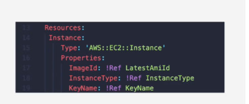

# CloudFormation Service

## Templates

AWSTemplateFormatVersion: "version date"

Description:
String

Metadata:
template metadata

Parameters:
set of parameters

Mappings:
set of mappings

Conditions:
set of conditions

Resources:
set of resources

Outputs:
set of outputs

# logical resources

Resources inside cloud formation template are 'logical resources' they contain properties

# stack

Contains logical resources
